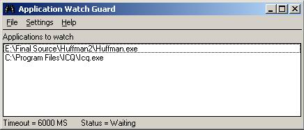



## Application Watch Guard

### Description

Shows how to Terminate processes with priviliges.

The purpose of this application is to guard choosen applications from going down.

The Watch Guard checks each X seconds that the choosen application is responding.

If it is not responding it has either been shutdown, crashed or has frozen.

First the watch Guard attempts to do a clean shutdown, incase the choosen

application has some savings of settings during shutdown, After that it terminate

the process to be on the safe side. Finally it starts up the application again.

It logs when the applications starts up and goes down.

The timeout for response is variable through settings

It is mainly for System Administrators who has applications running on machines

that absolutely is not allowed to be down for a longer period of time.

But it could benefit anyone who wish to guard a choosen application from going down.

Help me grow as a programmer, Constructive Feedback are greatly appreciated :-)
 
### More Info
 

             |
---                |---
**Submitted On**   |2004-03-22 18:39:52
**By**             |[Knoton](https://github.com/Planet-Source-Code/PSCIndex/blob/master/ByAuthor/knoton.md)
**Level**          |Advanced
**User Rating**    |5.0 (55 globes from 11 users)
**Compatibility**  |VB 6\.0
**Category**       |[Complete Applications](https://github.com/Planet-Source-Code/PSCIndex/blob/master/ByCategory/complete-applications__1-27.md)
**World**          |[Visual Basic](https://github.com/Planet-Source-Code/PSCIndex/blob/master/ByWorld/visual-basic.md)
**Archive File**   |[Applicatio172953462004\.zip](https://github.com/Planet-Source-Code/knoton-application-watch-guard__1-52919/archive/master.zip)

